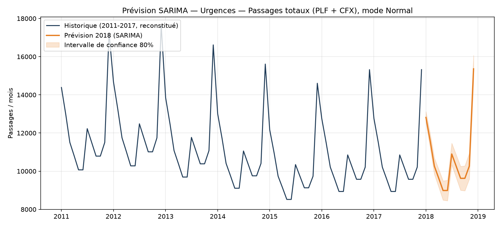
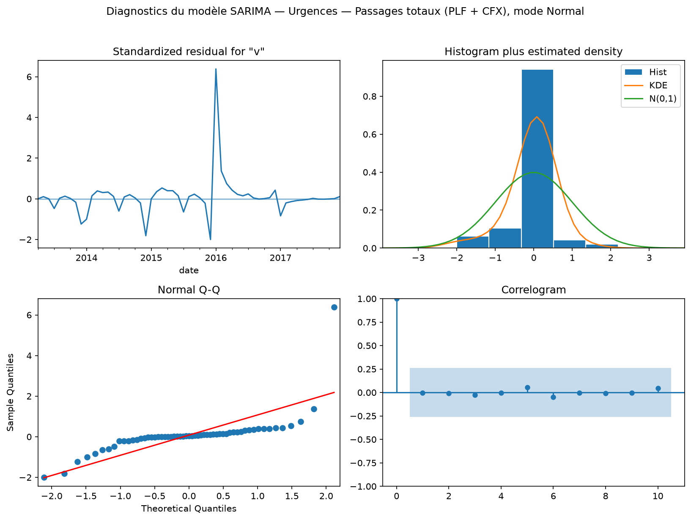

# Rapport technique — PSL-CFX

> Livrable 1/2 (cf. énoncé) : sources des données, traitements, choix et
> justification des modèles.

## 1. Sources des données

- Rapports "Chiffres Clés" annuels des Hôpitaux Universitaires Pitié-Salpêtrière —
  Charles Foix (AP-HP), disponibles dans `sources/` :
  - `SLP-CHF2012.pdf` — Chiffres Clés 2012
  - `SLP-CHX2015.pdf` — Chiffres Clés 2015
  - `SLP-CHF2016.pdf` — Chiffres Clés 2016
- Limite : uniquement 3 années disponibles, sous forme d'agrégats **annuels**
  (aucune donnée mensuelle/journalière dans les rapports sources).

## 2. Extraction et structuration du dataset

- Schéma commun retenu : `ANNEE, INDICATEUR, SOUS-INDICATEUR, PLF, CFX, TOTAL, UNITE`
  (`data/<domaine>/<domaine>-data.csv`, générés par `data/build_raw.py`).
- 6 domaines couverts : Activité & Service, Patients (pathologies), Capacité (lits),
  Finances, RH, Logistique.
- Domaine Qualité (indicateurs IPAQSS) volontairement exclu du dataset dynamique —
  voir §4.3.

### 2.1 Traçabilité par domaine (indicateur → source)

| Domaine | Sous-indicateur | Années | Page source |
| --- | --- | --- | --- |
| Activité & Service | Urgences — Passages totaux | 2011, 2012, 2015, 2016 | 2012 p.4 ; 2015 p.7 ; 2016 p.4 |
| Activité & Service | Urgences — Patients admis en hospitalisation | 2011, 2012, 2015 | 2012 p.4 ; 2015 p.7 |
| Activité & Service | Consultations externes | 2012, 2015, 2016 | 2012 p.2/4 ; 2015 p.6 ; 2016 p.4 |
| Activité & Service | Séjours HC (>24h) / Ambulatoire (<24h) | 2012, 2015, 2016 | 2012 p.4 ; 2015 p.6 ; 2016 p.4 |
| Activité & Service | Actes opératoires | 2016 | 2016 p.4 |
| Activité & Service | Naissances / Greffes | 2012, 2015, 2016 | 2012 p.1 ; 2015 p.15 ; 2016 p.4 |
| Patients | 9 causes d'hospitalisation (nb de séjours) | 2012, 2015 | 2012 p.3 ; 2015 p.5 |
| Capacité | Lits totaux + répartition MCO/SSR/SLD/PSY | 2012, 2015, 2016 | 2012 p.3 ; 2015 p.4 ; 2016 p.4 |
| Finances | Dépenses d'exploitation / Recettes | 2012, 2015, 2016 | 2012 p.4 ; 2015 p.9 ; 2016 p.4 |
| RH | Médecins (ETP / effectif physique), Personnel paramédical (ETP) | 2012, 2015, 2016 | 2012 p.2 ; 2015 p.10 ; 2016 p.4 |
| Logistique | Restauration, DASRIA, DAOM/DMA | 2012, 2015 | 2012 p.2 ; 2015 p.11 |

### 2.2 Erreurs et lacunes corrigées lors de l'audit

Une relecture croisée ligne à ligne de `data/build_raw.py` contre les 3 PDF
sources (postérieure à une première version du dataset) a permis de corriger :

- **Année erronée** : "Actes opératoires" (47 925) avait été attribué à 2015 ;
  ce chiffre appartient en réalité au rapport **2016** (`SLP-CHF2016.pdf` p.4).
  Il est absent du rapport 2015.
- **Donnée disponible mais non saisie** : "Patients admis en hospitalisation"
  2011 = 6 083 (PSL), donné en toutes lettres p.4 du rapport 2012, n'avait pas
  été repris (seul 2012 l'était).
- **Répartition PLF/CFX disponible mais non saisie** : "Consultations
  externes" 2015 n'avait été saisi qu'en TOTAL (607 950), alors que le rapport
  2015 (p.6) donne le détail PSL 597 660 / CFX 10 290 — la reconstruction par
  ratio (§3.1) n'était donc pas nécessaire pour cette ligne.

## 3. Traitements appliqués

### 3.1 Interpolation inter-annuelle
`data/pipeline.py::interpolate_annual` — comble les années manquantes (2011,
2013, 2014, 2017) par interpolation linéaire entre les points connus (2012,
2015, 2016), avec extrapolation aux bornes. Reconstruction croisée PLF/CFX/TOTAL
quand une seule des trois valeurs est publiée : lorsqu'aucune année ne fournit
PLF et CFX simultanément, un ratio par défaut de 0,5 est utilisé pour répartir
un TOTAL isolé.

**Limites identifiées :**

- L'interpolation linéaire n'a aucune logique métier : c'est une droite entre
  deux points connus, qui ne peut pas capter un effet de seuil (ouverture d'un
  service, réorganisation) survenu entre deux rapports.
- Les indicateurs n'ayant qu'**un seul point connu sur toute la période**
  (ex. "Actes opératoires", "Naissances", "Greffes") sont in fine **constants**
  sur 2011-2017 : l'extrapolation aux bornes de pandas (`limit_direction='both'`)
  prolonge une valeur unique à plat, ce qui n'a pas de sens comme "tendance"
  mais reste la meilleure hypothèse neutre disponible avec seulement 1 point.
- Le ratio par défaut à 0,5 (quand PLF/CFX ne sont jamais connus ensemble) est
  une hypothèse arbitraire. Pour "Urgences → Passages totaux" et "Patients
  admis en hospitalisation", ce cas se présente car **la nature même des
  données diffère d'une année sur l'autre** (voir point suivant) — corriger le
  ratio n'aurait pas réglé le problème de fond.
- **Rupture de périmètre non réconciliable, documentée plutôt que masquée** :
  - *Urgences → Passages totaux* : 2011/2012 (83 002 / 85 993) est un chiffre
    **PSL seul** ("Les urgences de La Pitié-Salpêtrière", 2012 p.4). 2015
    (121 721) additionne 59 072 passages au SAU **et** 62 649 aux urgences
    **dentaires** (2015 p.7). 2016 (127 678) se décompose différemment
    ("dont 61 651 aux urgences spécialisées", 2016 p.4). Ces trois valeurs ne
    mesurent pas le même périmètre : leur évolution ne doit pas être lue comme
    une série continue. Un avertissement est affiché directement dans le
    dashboard (onglet "Urgences" de la page Urgences & Activité).
  - *RH → Médecins (ETP)* : 2012 (1 253) et 2015 (1 621) incluent les
    internes/résidents/FFI. 2016 (947) les compte à part ("465 internes"
    listés séparément, 2016 p.4) — l'ETP des internes n'étant pas publié pour
    2016, aucune reconstruction comparable n'est possible. C'est une rupture
    de série, pas une baisse réelle d'effectifs — avertissement affiché dans
    le dashboard (onglet "Effectifs" de la page RH).
  - En revanche, pour "Médecins (effectif physique)" et "Personnel
    paramédical (ETP)", le rapport 2016 publie les sous-catégories qui
    permettent de reconstituer un périmètre comparable à 2012/2015 (calcul
    détaillé en commentaire dans `data/build_raw.py`) : ces deux séries ont
    donc pu être **corrigées** plutôt que simplement documentées.

### 3.2 Simulation de crise sanitaire
`data/pipeline.py::apply_crisis` — coefficient multiplicatif unique par domaine,
appliqué à la valeur annuelle interpolée :

| Domaine | Coefficient | Source / justification |
| --- | --- | --- |
| Activité & Service | ×1,6 | Modélise un scénario de **tension aiguë sur les urgences et les soins critiques** (et non l'activité hospitalière moyenne — voir nuance ci-dessous). Ancré sur la fourchette basse des besoins en réanimation observés en Île-de-France au printemps 2020, où les lits nécessaires ont représenté jusqu'à 250 % de la capacité disponible fin 2019 (DREES, ER n°1289 ; Assemblée nationale, QE n°27919/37686). |
| Patients | ×1,8 | Même logique que ci-dessus, calibré un cran au-dessus car cet indicateur suit spécifiquement les pathologies génératrices d'hospitalisations lourdes (proche du profil réanimation), à l'intérieur de la fourchette régionale IDF 140-250 % observée en 2020. |
| Capacité | ×1,15 | **Bien sourcé** : le nombre de lits de réanimation en France est passé de 5 420 (fin 2019) à 6 210 (fin 2020), soit **+14,5 %** — quasiment le coefficient retenu (DREES, ER n°1289, déc. 2023). Comme les lits de réanimation ne sont qu'une fraction des lits "toutes disciplines" (indicateur de ce dataset), +15 % au global est un ordre de grandeur cohérent, voire prudent, pour un hôpital d'Île-de-France en première ligne. |
| Finances | ×1,30 | **Volontairement prudent, à relativiser** : la Cour des comptes chiffre le surcoût national COVID pris en charge par l'Assurance Maladie à 3 Md€ en 2020 (≈ 3 % des dépenses hospitalières publiques nationales) — bien en-dessous de +30 %. Le coefficient retenu ici représente une hypothèse de planification budgétaire prudente pour un établissement d'Île-de-France, épicentre de la première vague, et non la moyenne nationale. À corriger si l'objectif devient une estimation réaliste plutôt qu'un scénario de préparation au pire cas. |
| RH | ×1,10 | Cohérent avec la hausse observée de l'absentéisme hospitalier pendant la crise (d'environ 9-11 % en 2019 à 10-13 % en 2020-2021 selon FHF/établissements médico-sociaux). Le concept modélisé ici (effectifs *mobilisés* en renfort) n'est pas strictement identique à l'absentéisme, mais l'ordre de grandeur (+1 à +3 points, soit ~+10 %) est comparable. |
| Logistique | ×1,25 | **Le moins bien sourcé des six** : la littérature (HCSP, avis 2020-2021) confirme qualitativement une hausse notable des DASRI dans les régions les plus touchées, sans fournir de pourcentage nationalement consolidé permettant de valider précisément +25 %. Reste une hypothèse à affiner si une source chiffrée est trouvée. |

**Sources consultées** (recherche web, résumées ci-dessus) :

- DREES, *Nombre de lits en réanimation : l'adaptation du système hospitalier
  pendant la crise due au Covid-19*, Études et Résultats n°1289, décembre 2023.
- ATIH, *Analyse de l'activité hospitalière 2020 — focus COVID-19*.
- Cour des comptes, *La situation financière des hôpitaux publics après la
  crise sanitaire*, rapport public thématique, octobre 2023.
- Assemblée nationale, questions écrites QE n°27919 et n°37686 (capacité
  réanimation Île-de-France, mars-avril 2020).
- Fédération Hospitalière de France (FHF) / retours établissements — taux
  d'absentéisme hospitalier 2019-2020.
- Haut Conseil de la Santé Publique (HCSP), avis sur la gestion des DASRI
  pendant l'épidémie de Covid-19 (2020-2021).

**Nuance importante à assumer à l'oral** : ces sources montrent aussi que
l'**activité hospitalière globale a en réalité baissé en 2020** (ATIH/DREES
signalent un recul historique de -17,3 % des passages aux urgences,
directement lié au confinement et à la déprogrammation des soins non urgents).
Le coefficient ×1,6 retenu ici ne prétend donc pas reproduire la moyenne
observée en 2020, mais modéliser le **scénario de saturation des urgences et
des soins critiques** — celui que l'énoncé du projet demande explicitement de
préparer ("Saturation des services d'urgences", "Ruptures de stocks de
matériel", cf. `sources/Projet_Data_Ko.pdf` p.3) et celui qui est opérationnellement
pertinent pour les propositions du `rapport_mise_en_place.md`. C'est un choix
de modélisation assumé, pas un raccourci non vu.

### 3.3 Reconstitution de la saisonnalité mensuelle
`data/pipeline.py::reconstruct_monthly` — profil de répartition mensuelle en %
assumé, appliqué uniquement aux domaines Activité & Service et Patients, où une
saisonnalité médicale a du sens :

- **Profil "normal"** (`DEFAULT_MONTH_PCT_NORMAL`) : légère sur-activité en
  hiver (décembre-janvier, cohérent avec le pic saisonnier de grippe et de
  décompensations hivernales bien documenté par Santé Publique France) et un
  second pic modéré l'été (traumatologie estivale, canicule).
- **Profil "crise"** (`DEFAULT_MONTH_PCT_CRISE`) : creux en début d'année,
  montée brutale au printemps (mars-avril), rechute, deuxième vague à
  l'automne — calqué sur le profil observé de la première vague COVID en
  Île-de-France (pic de lits de réanimation atteint le 15 avril 2020,
  proportion de patients COVID en réanimation atteignant 60,9 % début avril).

Ces deux profils restent des **hypothèses de forme**, pas des séries
mesurées : aucune des 3 sources annuelles ne permet de vérifier la
répartition infra-annuelle réelle de PSL-CFX. Ils sont cohérents avec la
littérature générale, mais ne sont pas calibrés sur des données spécifiques à
l'établissement.

## 4. Choix et justification des modèles

### 4.1 Modèle prédictif : SARIMA
`utils.py::forecast_next_year` — `SARIMAX(order=(1,1,1), seasonal_order=(1,1,1,12))`
sur la série mensuelle reconstituée. Nécessite ≥ 24 points mensuels.

#### Visuel : la prévision en pratique

Figure générée par `docs/generate_figures.py` (réutilise directement
`utils.py::fit_forecast_model`, la même fonction que le dashboard — pas de
logique dupliquée) sur la série "Urgences → Passages totaux" (PLF+CFX, mode
Normal), la plus longue et la plus lisible du dataset :

Le modèle reproduit fidèlement le profil de saisonnalité mensuel injecté en
amont (pic récurrent en décembre, creux en milieu d'année) et prolonge cette
forme sur 12 mois, avec un intervalle de confiance à 80 % qui s'élargit
logiquement à mesure que l'horizon de prévision s'éloigne.

#### Visuel : diagnostics du modèle

Lecture des 4 panneaux (sortie standard `statsmodels`, `results.plot_diagnostics()`) :

- **Résidus standardisés** (haut gauche) : globalement centrés sur 0, sauf un
  **pic net à la jonction 2015-2016** (résidu > 6 écarts-types). Ce n'est pas
  un artefact du modèle mais la **trace directe** de la limite documentée en
  §3.1 : la répartition PLF/CFX des "Urgences" y est reconstruite avec un
  ratio par défaut faute d'année où les deux valeurs sont connues
  simultanément, ce qui crée un saut artificiel dans la série que le modèle
  ne peut pas anticiper. C'est un bon exemple concret de pourquoi la
  fiabilité du modèle est bornée par la qualité de la série d'entrée (§4.1
  ci-dessous), pas par un mauvais choix d'ordres SARIMA.
- **Histogramme / Q-Q plot** (queue de distribution à droite plus épaisse que
  la normale théorique) : cohérent avec ce même point isolé extrême, qui
  tire la distribution des résidus vers une asymétrie non-gaussienne.
- **Corrélogramme** (bas droite) : aucune autocorrélation résiduelle
  significative au-delà du retard 0 — le modèle capture bien la structure
  temporelle résiduelle, ce point isolé mis à part.

- **Choix des ordres** : (1,1,1) sur la composante non saisonnière capture une
  tendance simple (différenciation d'ordre 1) avec un terme autorégressif et
  un terme de moyenne mobile — un choix standard et robuste pour une première
  itération, sans sur-paramétrer un modèle sur seulement 7 années de données
  reconstruites. La composante saisonnière (1,1,1,12) reprend la même
  structure avec une période de 12 mois, cohérente avec le profil mensuel
  imposé en amont par `reconstruct_monthly`.
- **Limite de fond, à assumer clairement à l'oral** : la série d'entrée du
  modèle n'est **pas une série observée**, mais la reconstruction décrite en
  §3.3. Le modèle SARIMA apprend donc essentiellement à reproduire le profil
  de saisonnalité *que nous avons nous-mêmes injecté*, avec un peu de bruit
  lié à l'interpolation inter-annuelle. Sa valeur est démonstrative (montrer
  la mécanique d'une prévision saisonnière) plutôt que prédictive au sens
  strict — ce sera vrai tant que le dataset ne contiendra pas de vraies
  données mensuelles.
- `enforce_stationarity=False, enforce_invertibility=False` : nécessaire en
  pratique car la série reconstruite (interpolation + profil assumé) ne
  respecte pas toujours les conditions théoriques de stationnarité d'un
  process ARIMA classique ; sans cette option, `statsmodels` échoue à
  converger sur certaines sous-séries à faible variance.

### 4.2 Simulation de crise : approche multiplicative
Choix d'un coefficient unique par domaine plutôt qu'un modèle plus fin (ex.
courbe épidémique SIR, modélisation différenciée par sous-indicateur) :
justifié par la simplicité et la lisibilité pour un public non technique
(contrainte explicite de l'énoncé : "pas de jargon mathématique / scientifique
/ informatique"), et par le fait que le dataset source (3 points annuels) ne
contient de toute façon pas assez d'information pour calibrer un modèle plus
riche sans sur-ajuster. Le prix de cette simplicité : un coefficient unique
gomme l'hétérogénéité réelle observée en 2020 (baisse de l'activité
programmée vs explosion de la réanimation) — assumé et documenté en §3.2.

### 4.3 Exclusion du domaine Qualité
Les indicateurs IPAQSS sont des taux de traçabilité en %, plafonnés à 100.
Un coefficient multiplicatif (utilisé pour les volumes) ferait mécaniquement
dépasser 100% pour toute valeur de départ > 100/coefficient — non pertinent.
Une approche additive plafonnée (`min(100, valeur + delta)`) serait nécessaire
si ce domaine doit être intégré ultérieurement.

## 5. Limites générales et pistes d'amélioration

- Seulement 3 années sources → interpolation/extrapolation fragiles ; les
  indicateurs à un seul point connu (Actes opératoires, Naissances, Greffes)
  restent constants sur toute la période reconstituée.
- Saisonnalité et crise = hypothèses de forme documentées, pas des données
  mesurées pour PSL-CFX spécifiquement.
- Deux ruptures de périmètre non réconciliables avec les 3 sources
  disponibles (Urgences, Médecins ETP) — signalées dans le dashboard plutôt
  que masquées ; obtenir le détail méthodologique exact auprès de la
  direction des Hôpitaux Universitaires PSL-CFX permettrait de les corriger.
- Le coefficient de crise "Finances" (×1,30) est délibérément plus prudent
  que la moyenne nationale observée en 2020 (≈ 3 % de surcoût, Cour des
  comptes) : à faire évoluer selon l'usage visé (scénario de préparation au
  pire cas vs estimation réaliste).
- Le coefficient "Logistique" (×1,25) reste le moins solidement sourcé des
  six : une source chiffrée sur l'évolution des DASRI en Île-de-France en
  2020 permettrait de l'affiner.
- Le modèle SARIMA est entraîné sur une série reconstruite, pas observée :
  sa valeur est pédagogique/démonstrative plus que réellement prédictive.
